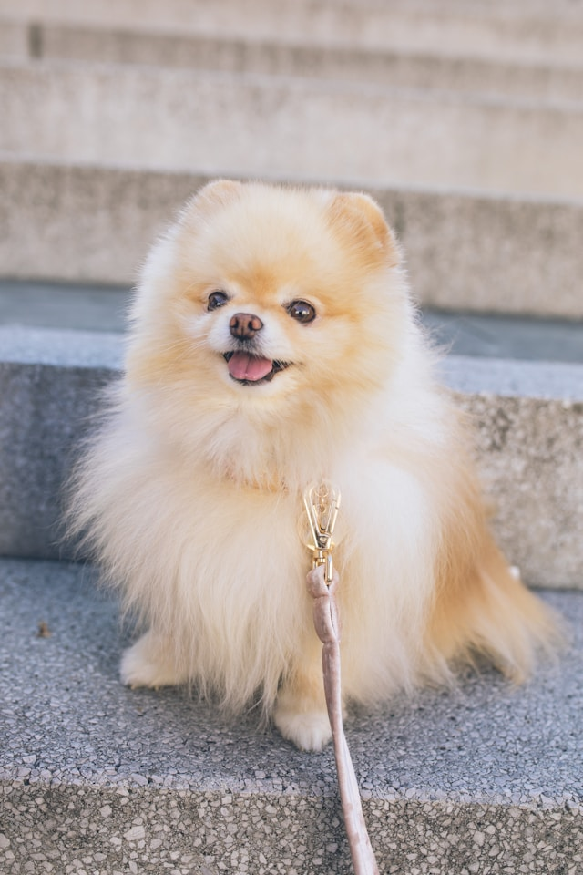

# Questions for Manual Review

## custom_76105294
¿Cuál es la salida del siguiente *script* de Python que utiliza un **decorador**? `def mi_decorador(func): def wrapper(): print('Antes de la función.') func() print('Después de la función.') return wrapper @mi_decorador def di_whee(): print('¡Whee!') di_whee()`

* Imprime 'Antes de la función.', luego '¡Whee!', y después 'Después de la función.'
* Imprime solamente '¡Whee!'
* Imprime '¡Whee!', luego 'Antes de la función.', y después 'Después de la función.'
* Lanza un `TypeError` cuando se ejecuta el código del decorador

## custom_12452655
Al calcular la suma de los cuadrados de los primeros *N* números usando la fórmula $S_N = \sum_{i=0}^{N-1} i^2$, si *N* es un número muy grande, ¿cuál es la **diferencia principal** en el uso de memoria entre `sum([i*i for i in range(N)])` y `sum(i*i for i in range(N))`?

* La expresión generadora `(i*i for i in range(N))` consume mucha menos memoria porque genera los valores uno por uno, a medida que se necesitan
* La comprensión de lista `[i*i for i in range(N)]` es más eficiente en memoria porque asigna el espacio completo para la lista al inicio
* No hay una diferencia significativa en el uso de memoria; el intérprete de Python optimiza ambas para que se comporten de manera similar
* La expresión generadora `(i*i for i in range(N))` es a menudo computacionalmente más rápida, lo que podría implicar un mayor uso de memoria

## image_05270722
> 

Si estuvieras modelando los datos de un perro en Python usando un diccionario, ¿cuál de las siguientes opciones de código sería la representación más precisa, considerando que su felicidad parece alta y que las razas 'Pomerania' y 'Spitz enano' son la misma?

* `datos_perro = {'raza': 'Pomerania', 'color': 'crema', 'en_correa': True, 'nivel_felicidad': 0.9}`
* `datos_perro = {'raza': 'Samoyedo', 'color': 'blanco', 'en_correa': True, 'nivel_felicidad': 0.7}`
* `datos_perro = {'raza': 'Pomerania', 'color': 'negro', 'en_correa': False, 'nivel_felicidad': 0.5}`
* `datos_perro = {'raza': 'Spitz enano', 'color': 'crema', 'en_correa': False, 'nivel_felicidad': 0.2}`

